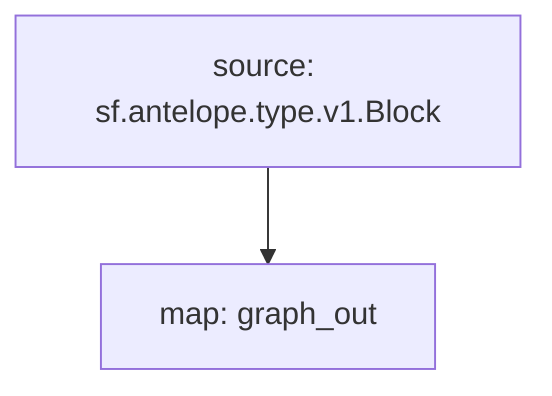

# Subgraph: `Antelope Transactions`

> Transactions, Decoded Actions & Database Operations
>
> WAX, EOS, Ultra, Telos...
> [`sf.antelope.type.v1.Block`](https://buf.build/pinax/firehose-antelope/docs/main:sf.antelope.type.v1)

- [x] **Blocks**
- [x] **Transactions**
  - [x] **DatabaseOperations**
- [x] **Actions**
  - [x] **Authorization**
  - [x] **Receiver**

## Chains

- **API Key**: <https://thegraph.com/studio/apikeys/>
- **Base URL**: <https://gateway.thegraph.com/api>
- **Subgraph ID**:
  - `4bAe7NA8b6J14ZfZr3TXfzzjjSoGECTFuqv7CwnK1zzg`
  - `2RNdhL5p62dGN5UqKtsSEhYZiTJbFcuuhzk9qRJj8QeU`
- **Subgraph NFT**:
  - `24120480333211569189943591992759279596987552413186298385524741791011616341845`
  - `9544660660697512970420034067948120535763746642726326018982449681191462590993`
- **Query URL format**: `{base_url}`/api/`{api-key}`/subgraphs/id/`{subgraph_id}`

| Chain | Subgraph ID |
| ----- | ----------- |
| WAX   | [`4bAe7NA8b6J14ZfZr3TXfzzjjSoGECTFuqv7CwnK1zzg`](https://thegraph.com/explorer/subgraphs/4bAe7NA8b6J14ZfZr3TXfzzjjSoGECTFuqv7CwnK1zzg?view=Query&chain=arbitrum-one) |
| EOS   | [`2RNdhL5p62dGN5UqKtsSEhYZiTJbFcuuhzk9qRJj8QeU`](https://thegraph.com/explorer/subgraphs/2RNdhL5p62dGN5UqKtsSEhYZiTJbFcuuhzk9qRJj8QeU?view=Query&chain=arbitrum-one) |
| Kylin (Testnet)   | [`GpJpCvfozP3XWQRomagcU8t4tzmU5A788VNqKZuR2rCb`](https://thegraph.com/explorer/subgraphs/GpJpCvfozP3XWQRomagcU8t4tzmU5A788VNqKZuR2rCb?view=Query&chain=arbitrum-one) |

| Chain | Subgraph ID (UInt256) |
| ----- | ----------- |
| WAX   | 24120480333211569189943591992759279596987552413186298385524741791011616341845 |
| EOS   | 9544660660697512970420034067948120535763746642726326018982449681191462590993 |
| Kylin | 106289533677304394555302740866367069211059282291100697030374629879842757021100 |

## GraphQL

```graphql
{
  actions(
    where: {isNotify: false, account: "eosio.token"}
    orderBy: block_number
    orderDirection: desc
  ) {
    timestamp
    block_number
    transaction {
      id
    }
    account
    name
    jsonData
    dbOps {
      code
      tableName
      primaryKey
      newDataJson
    }
  }
}
```

## Substreams Modules



### Example queries

- `code:mycontract`
- `code:tethertether && action:issue`
- `code:eosio.token && action:transfer && (data.to:myaccount || data.from:myaccount)`
- `auth:myaccount@active`
- `code:atomicassets && action:logmint`

### Available query fields

These are the expressions that can be used in queries:

- `action:<action_name>` - action name
- `code:<account>` - smart contract account name
- `receiver:<account>` - action receiver account
- `auth:` - account which authority was used to sign the action, i.e.
  - `auth:<account>` - account with any permission
  - `auth:<account>@<permission>` - account with a specific permission
- `input:true` - will match only the top-level actions
- `notif:true` - will match only notifications, excluding input action or other inline actions.
- `data.<field>:` - will decode and match action parameters (doesn't support nested objects). Some examples:
  - `data.from:myaccount`
  - `data.memo:"your daily staking rewards"`
- `db.table:<table_name>`
- `db.table:<table_name>/<scope>`

Queries can include `&&` and `||` logical operands, as well as `(` and `)` parenthesis.
